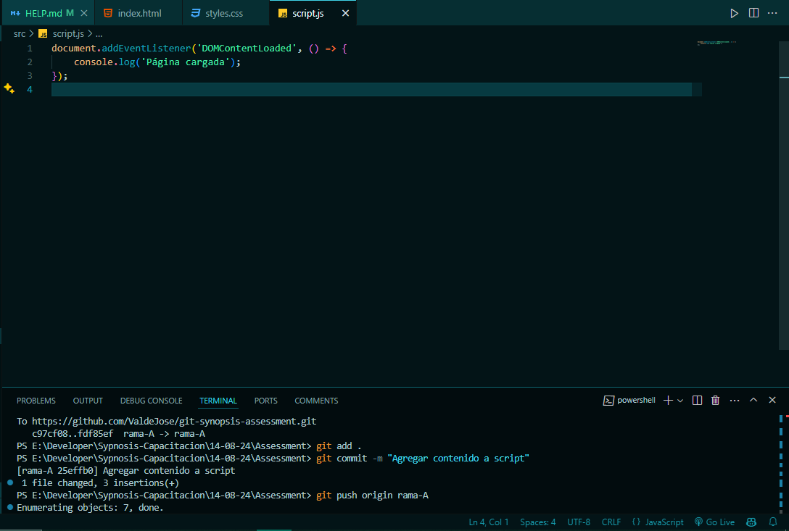

# Solución - JoseV

# Actividades principales

## Actividad 1
1. Genere un fork desde el repositorio 'git-synopsis-assessment' hacia mi cuenta de github
    
    
2. Usando la terminal de VScode, inicialice git en una carpeta local ('git init'), para luego conectarla con mi repositorio remoto ('git remote add origin')
    
3. Genere una nueva rama'rama-A' a partir de la rama 'main' desde el terminal, haciendo un pull desde la rama main
    
4. Agrege una carpeta src en el directorio principal y dentro de ella agrege 3 archivos('index.html' , 'styles.css', 'script.js')
    
5. Agrege contenido a los 3 archivos, y posteriormente realice un commit y un push a la rama-A
    
    
    

## Actividad 2

1. Como el directorio no cuenta con un archivo '.gitignore' , agrege uno
    
2. Agrege las lineas '/bin/', '/node_modules/', '/target/' al .gitignore para que que ignore los directorios /bin, /node_modules y /target en cualquier parte del proyecto. Tambien, realize el respectivo commit y push a la rama-A
    

## Actividad 3

1. Cree las dos nuevas carpetas vacias en el directorio, usando el terminal y el comando 'mkdir'
    
    
2. Para evitar la limitacion de Git de no gestionar carpetas vacias, cree un archivo vacio '.gitkeep' dentro de ambas carpetas, y finalmente realice el commit y push
    
    
    
## Actividad 4

1. Crea una nueva rama 'rama-B' a partir de la rama 'rama-A' 
    
2. Primero, modifique el archivo HELP.md, agregando un h1('# Actividades principales') antes de los h2 de las actividades del 1 al 7, asi como tambien agrege en la parte de abajo un h1('# Actividades extras') y sus 2 actividades h2. Despues, le cambie el nombre a una de las carpetas vacias que cree con anterioridad(Valde -> Rrama). Para luego, cambiar el 'background' de body y .container en el archivo src/styles.css. Finalmente, hice un commit y push a la rama-B.

3. 

## Actividad 5

1. 

2. 

3. 

## Actividad 6

1. 

2. 

3. 

## Actividad 7

1. 

2. 

3. 

# Actividades extras

## Actividad 1

1. 

2. 

3. 

## Actividad 2

1. 

2. 

3. 