# Solución - JoseV

# Actividades principales

## Actividad 1
1. Genere un fork desde el repositorio 'git-synopsis-assessment' hacia mi cuenta de github
    
    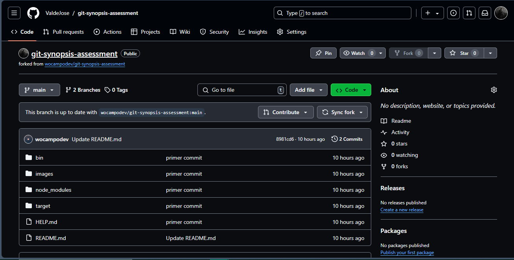
2. Usando la terminal de VScode, inicialice git en una carpeta local ('git init'), para luego conectarla con mi repositorio remoto ('git remote add origin')
    
3. Genere una nueva rama'rama-A' a partir de la rama 'main' desde el terminal, haciendo un pull desde la rama main
    
4. Agrege una carpeta src en el directorio principal y dentro de ella agrege 3 archivos('index.html' , 'styles.css', 'script.js')
    
5. Agrege contenido a los 3 archivos, y posteriormente realice un commit y un push a la rama-A
    
    
    

## Actividad 2

1. Como el directorio no cuenta con un archivo '.gitignore' , agrege uno
    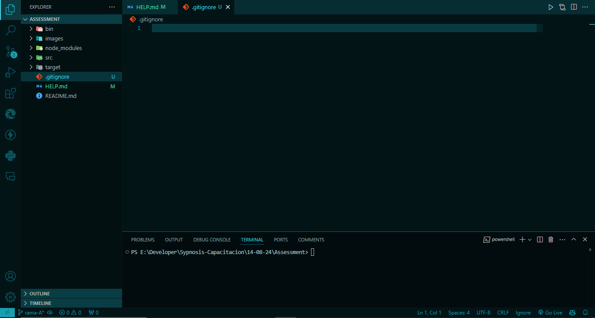
2. Agrege las lineas '/bin/', '/node_modules/', '/target/' al .gitignore para que que ignore los directorios /bin, /node_modules y /target en cualquier parte del proyecto. Tambien, realize el respectivo commit y push a la rama-A
    

## Actividad 3

1. Cree las dos nuevas carpetas vacias en el directorio, usando el terminal y el comando 'mkdir'
    
    
2. Para evitar la limitacion de Git de no gestionar carpetas vacias, cree un archivo vacio '.gitkeep' dentro de ambas carpetas, y finalmente realice el commit y push
    
    
    
## Actividad 4

1. Crea una nueva rama 'rama-B' a partir de la rama 'rama-A' 
    
2. Primero, modifique el archivo HELP.md, agregando un h1('# Actividades principales') antes de los h2 de las actividades del 1 al 7, asi como tambien agrege en la parte de abajo un h1('# Actividades extras') y sus 2 actividades h2. Despues, le cambie el nombre a una de las carpetas vacias que cree con anterioridad(Valde -> Rrama). Para luego, cambiar el 'background' de body y .container en el archivo src/styles.css. Finalmente, hice un commit y push a la rama-B.
    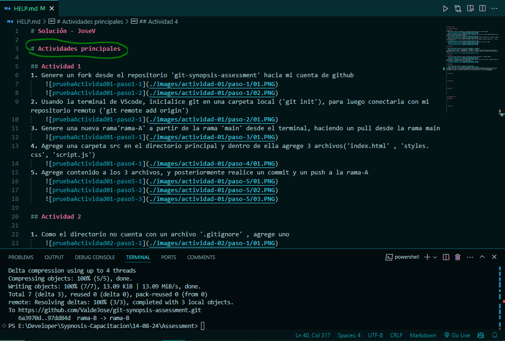
    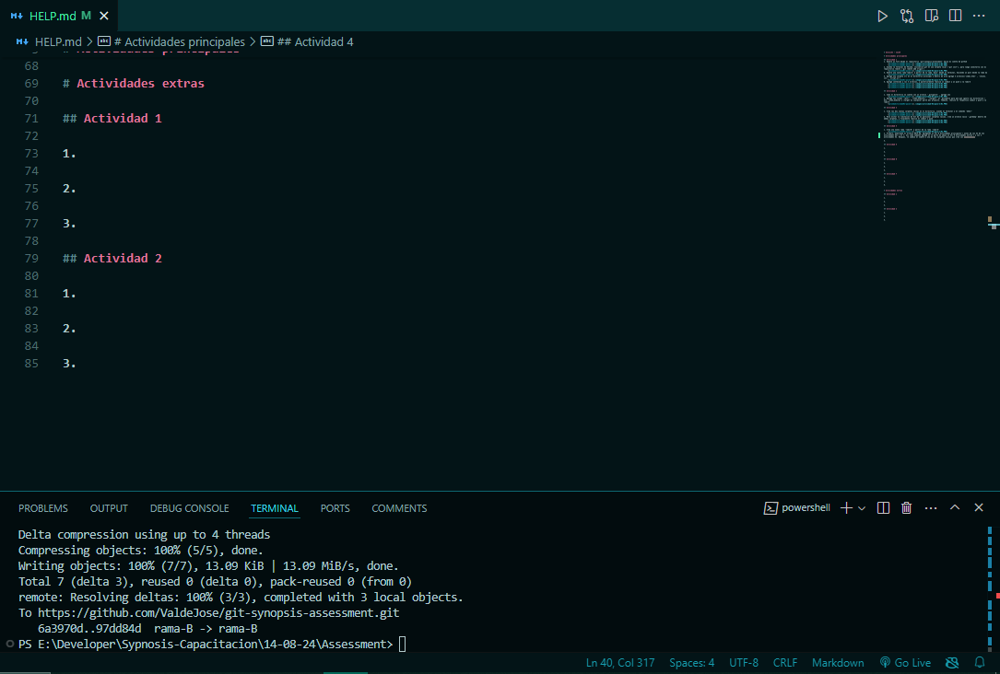
    
    
    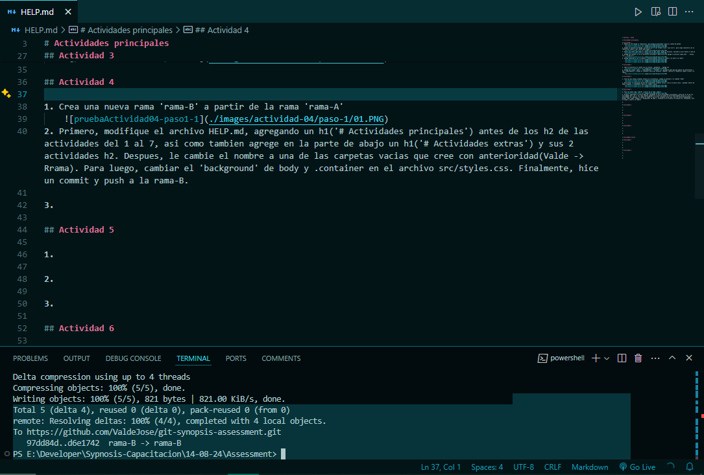

3. Cambie a la rama-A ('git checkout') y luego integre los cambios de la 'rama-B' a la 'rama-A' ('git merge')
    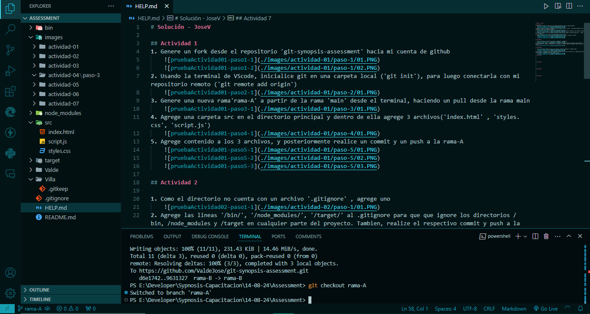
    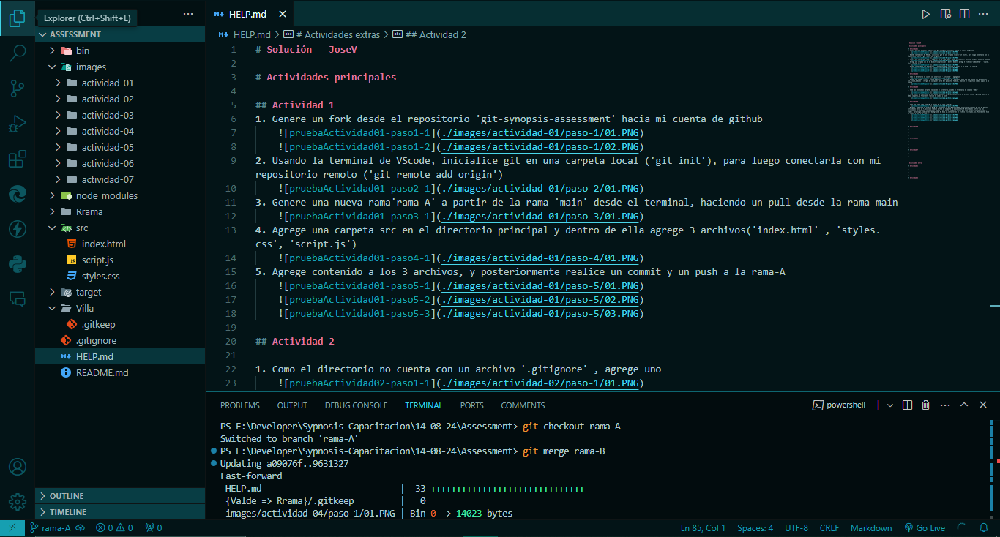

## Actividad 5

1. Primero cambio a la rama 'hotfix/main' para encontrar el commit con el mensaje "FIX: issue 2", para lo cual hice uso del comando 'git log --oneline', tras lo cual, guardo el hash del commit('f5b37d2')
    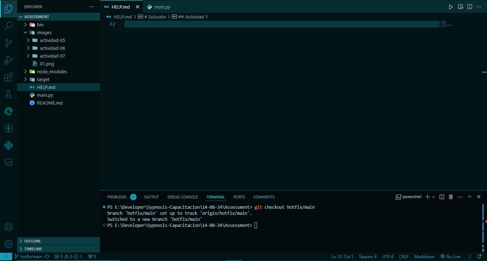
    
2. Vuelvo a la rama-A, y uso el comando 'cherry-pick' para integrar solo ese commit específico en la rama-A. al aplicar el commit me encuentro con un error.
    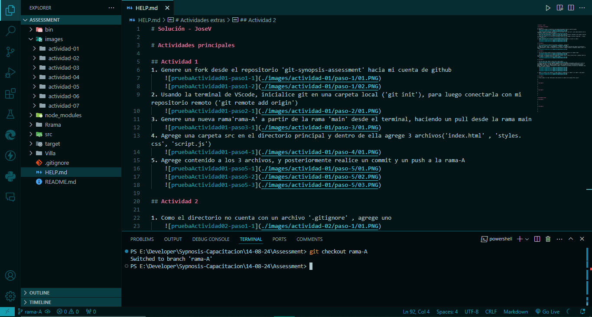
    

3. Al ver que el conflicto es porque el archivo main.py ha sido eliminado de mi rama-A, opto por restaurar el archivo desde el commit usando el comando ('git restore --source=f5b37d2 --staged main.py', 'git restore --source=f5b37d2 main.py'), despues al ver que me sale el mensaje de que los conflictos han sido resueltos, procedo a usar el comando ('git cherry-pick --continue'), tras lo cual obtengo un mensaje de que el commit esta vacio, asi que uso el comando ('git commit --allow-empty') para proceder con el cherry-pick
    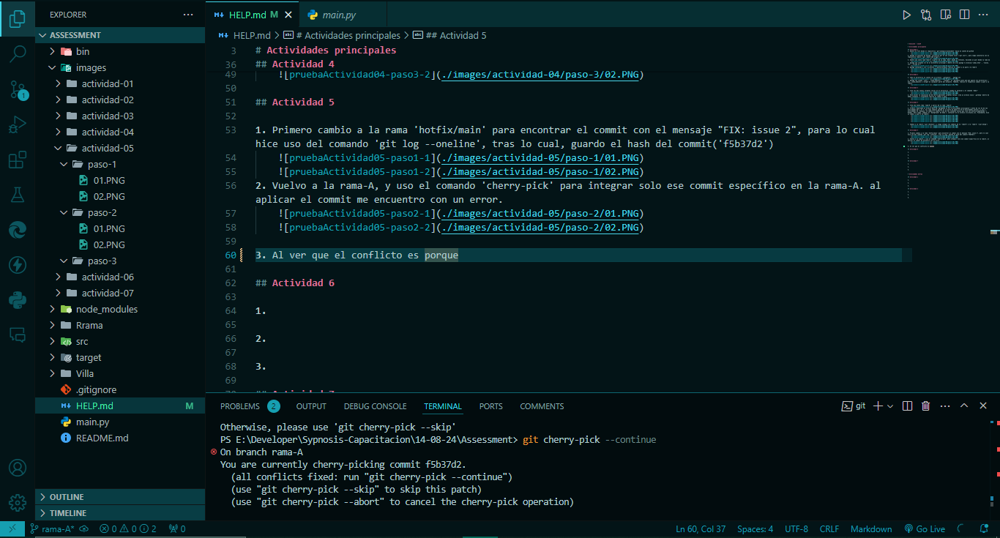
    

## Actividad 6

1. Ingreso a la rama-A, y modifico en archivo HELP.md, en el paso 1 y modifico el archivo main.py cambianod el print de 'mundo' por mi nombre y agregando un print 'te saluda'. Luego de realizar estos cambios uso el comando('git stash') para guardar los cambios en un lugar temporal que no se rastree en el historial de commits
    

2. Ingreso a la rama-B y aplico los cambios guardado en el lugar temporal usando el comando 'git stash apply'. Ahora vuelvo a modificar el archivo HELP.mp en el paso 1 y paso 2, y agrego un print('desde la rama-B') en el main.py, para luego volver a guardar estos cambios en un lugar temporal con 'git stash'
    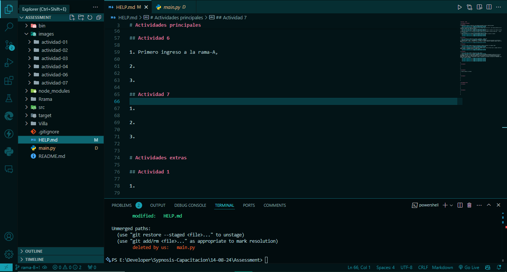
    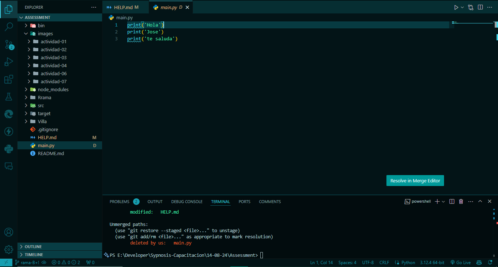
    
    

3. Ingreso a la rama-A y uso el comando 'git stash apply' para aplicar los cambios hechos en la rama-B, y finalmente uso el comando 'git stash drop' para limpiar el 'stash'
    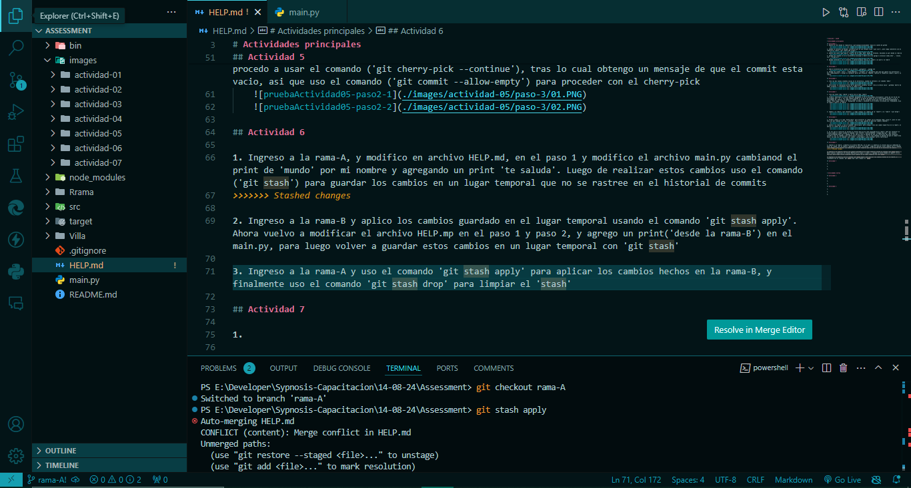
    

## Actividad 7

1. Para crear un tag para el lanzamiento se pueden hacer de dos formas. ya sea usando el comando 'git tag -a v1.0.0 -m', o Ingresando al repositorio por la pagina web/App de github y seleccionando la opcion de tag, crear nuevo tag y rellenar los datos
    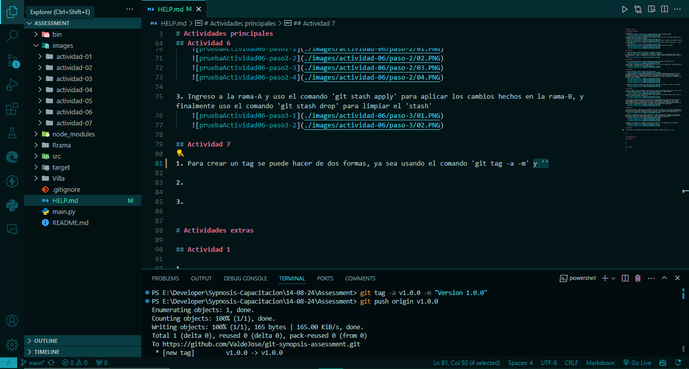
    
    
    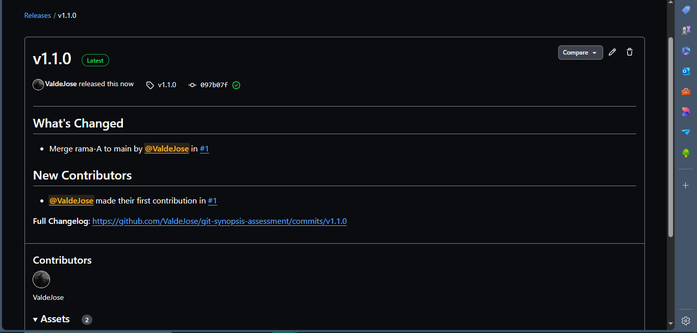

# Actividades extras

## Actividad 1

1. Cuando modifico mi archivo main.py y lo agrego al stagging area(zona previa al commit), pero aun no le hago el commit, puedo devolver el archivo a su estado anterior (fuera del staggin area), usando el comando 'git restore --staged', esto devolvera mi archivo a su estado anterior pero mantendra mis cambios en mis archivos locales
    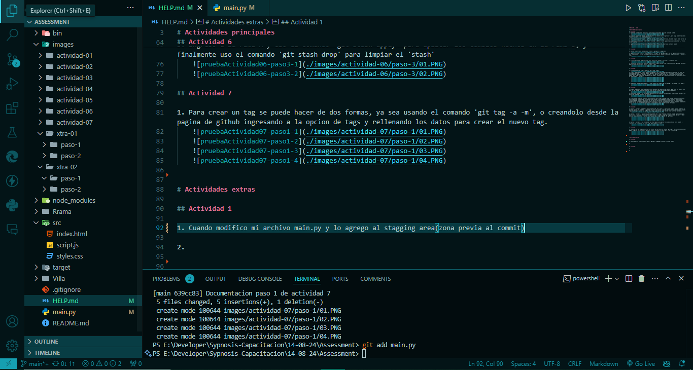
    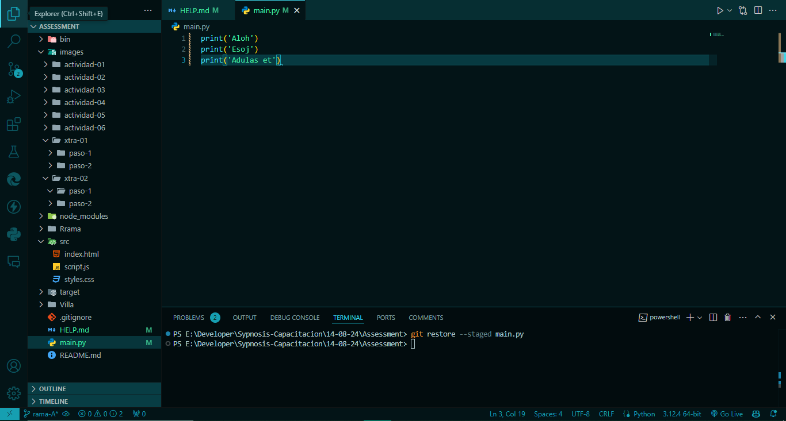

## Actividad 2

1. 

 